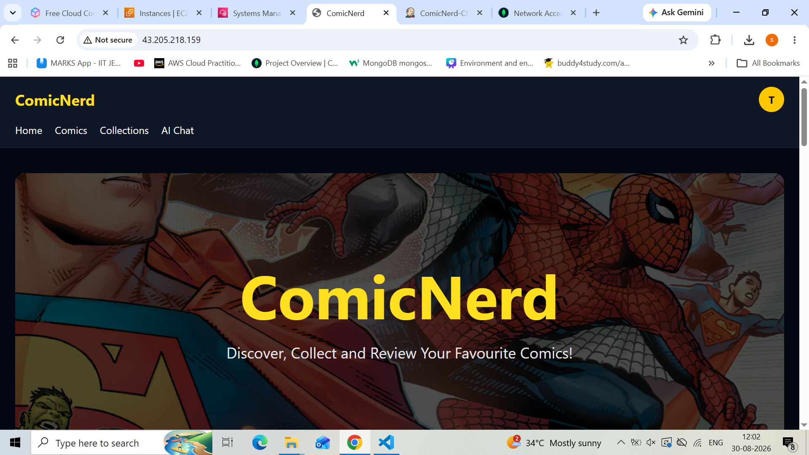
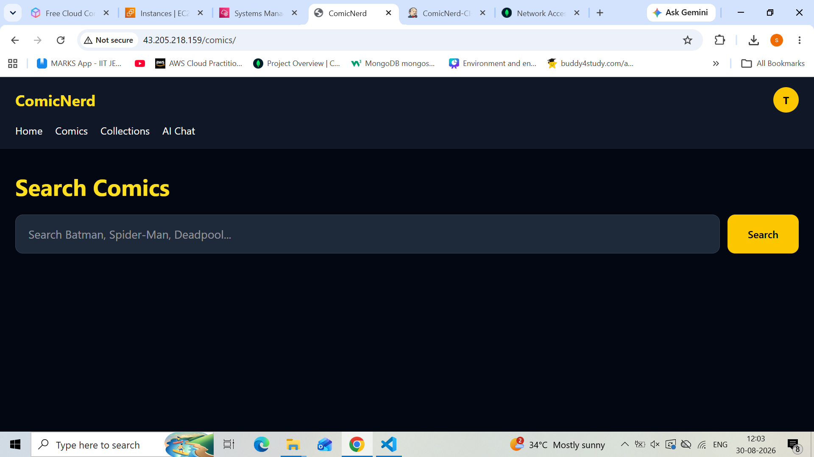
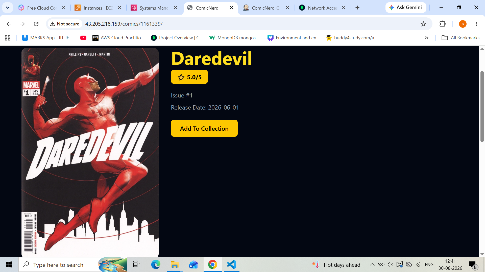
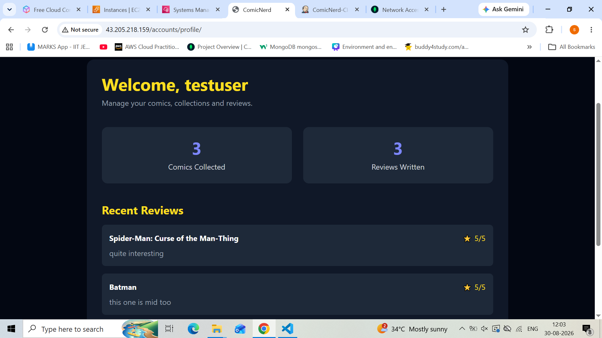
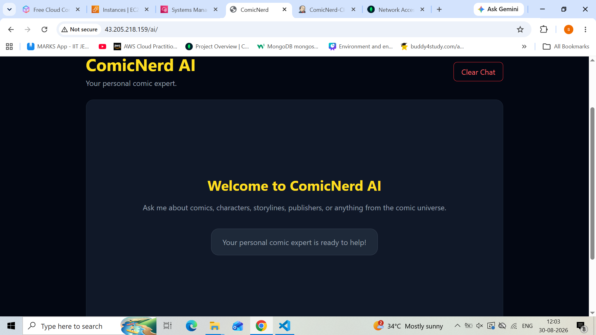
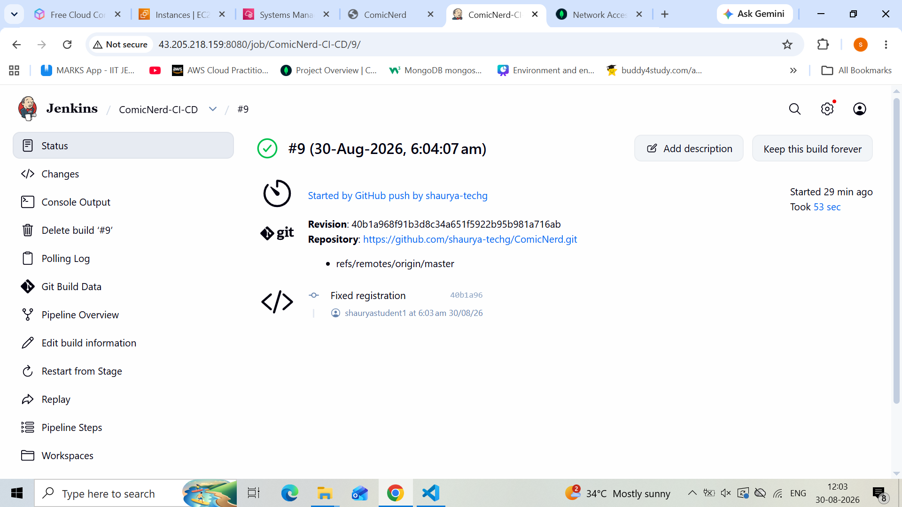
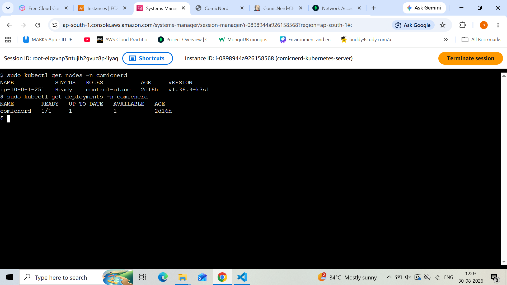

# ComicNerd

ComicNerd is a full-stack comic discovery and management web application and devops project built with Django. The platform allows users to search for comics, view comic details, create personal comic collections, write reviews, and interact with an AI-powered comic assistant.

The project also demonstrates a complete DevOps workflow using Docker, Jenkins, Kubernetes (K3s), Terraform, AWS, and CloudWatch.

---

## Architecture

ComicNerd follows a multi-tier architecture with separate application, database, and infrastructure components.

```text
                    Users
                      │
                      ▼
              Django Web Application
                      │
          ┌───────────┼───────────┐
          │           │           │
          ▼           ▼           ▼
     PostgreSQL   MongoDB Atlas  External APIs
                      │
                      │       ┌───────────────┐
                      │       │ ComicVine API │
                      │       └───────────────┘
                      │
                      │       ┌───────────────┐
                      └──────►│   Groq API    │
                              └───────────────┘
The application is containerized using Docker and deployed on a K3s Kubernetes cluster running on AWS EC2.

Features
-User Authentication
-User registration
-Duplicate username validation
-User login and logout
-User profile page
-Authentication-protected features
-Comic Discovery
-Search for comics using the ComicVine API
-View comic details
-Browse the latest comics
-Browse recently updated comic volumes
-Comic Collections

Users can:

-Add comics to their personal collection
-View saved comics
-Manage their comic collection
-Reviews and Ratings

Users can:

-Write reviews for comics
-Give ratings
-View reviews associated with comics
-AI Comic Assistant

ComicNerd includes an AI-powered assistant that allows users to ask questions related to:

-Comics
-Comic characters
-Storylines
-Comic universes
-General comic-related topics

The AI assistant is powered by the Groq API.

User Profile:

The profile page provides users with information about:

-Number of comics in their collection
-Number of reviews submitted
-Recent comic collections
-Recent reviews

----------------------------------------------------------

Technology Stack:

Frontend:
-HTML
-Tailwind CSS
-JavaScript
--------------
Backend:
-Python
-Django
--------------
Databases:
-PostgreSQL
-MongoDB Atlas
-SQLite for local development
---------------
APIs:
-ComicVine API
-Groq API
---------------
DevOps and Cloud:
-Docker
-Jenkins
-Kubernetes (K3s)
-Terraform
-AWS EC2
-AWS CloudWatch
-Docker Hub
----------------
Static File Handling:
-WhiteNoise
-CI/CD Pipeline Workflow

ComicNerd uses Jenkins to automate the build and deployment process.
--------------------------------------------------------------------------------

Pipeline Flow:
1.The developer pushes code changes to the GitHub repository.
2.Jenkins starts the CI/CD pipeline.
3.Jenkins pulls the latest source code from GitHub.
4.Jenkins builds a new Docker image for the Django application.
5.The Docker image is pushed to Docker Hub.
6.Jenkins deploys the updated application to the K3s cluster.
7.K3s pulls the updated image and deploys the application.
8.The updated ComicNerd application becomes available.
9.CI/CD Components
10.GitHub – Source code repository
11.Jenkins – CI/CD automation server
12.Docker – Builds the application container image
13.Docker Hub – Stores the application Docker image
14.Kubernetes (K3s) – Deploys and manages the application
15.AWS EC2 – Hosts Jenkins and the K3s cluster
----------------------------------------------------------------------------------
Pipeline Summary
Developer
    │
    ▼
GitHub Repository
    │
    ▼
Jenkins Pipeline
    │
    ├── Pull Latest Code
    │
    ├── Build Docker Image
    │
    ├── Push Image to Docker Hub
    │
    └── Deploy to K3s
            │
            ▼
      Kubernetes Deployment
            │
            ▼
       ComicNerd Application
----------------------------------------------------------------------------------------
Infrastructure Provisioning with Terraform

Terraform was used to provision and manage the AWS infrastructure required for ComicNerd.

Terraform Responsibilities:
-Provision the AWS EC2 instance used for the deployment environment
-Configure the required networking and security resources
-Manage infrastructure using Infrastructure as Code (IaC)
-Enable reproducible infrastructure deployment
-Benefits of Using Terraform
-Infrastructure configuration is version-controlled
-Resources can be created consistently
-Manual infrastructure configuration is reduced
-Changes to infrastructure can be managed through code
------------------------------------------------------------
Infrastructure Workflow:

Terraform Configuration
        │
        ▼
   Terraform Apply
        │
        ▼
AWS Infrastructure
        │
        ▼
   EC2 Instance
   ┌──────┴──────┐
   ▼             ▼
 Jenkins       K3s
                 │
                 ▼
        ComicNerd Application

-------------------------------------------------------------------
Monitoring with AWS CloudWatch:

AWS CloudWatch was used to monitor the AWS infrastructure hosting ComicNerd.

Monitoring Capabilities:

CloudWatch helps monitor the health and performance of the AWS EC2 instance running Jenkins and the K3s Kubernetes cluster.

Key metrics include:

-CPU utilization
-Network activity
-Disk and instance-level performance metrics
-Instance status and health
-Benefits
-Provides visibility into infrastructure performance
-Helps identify potential resource issues
-Enables monitoring of the EC2 deployment environment
-Supports troubleshooting and operational monitoring
--------------------------
Monitoring Flow:

AWS EC2 Instance
       │
       ▼
AWS CloudWatch
       │
       ├── CPU Metrics
       ├── Network Metrics
       ├── Instance Health
       └── Performance Monitoring
----------------------------------------------------------
Deployment Architecture:

ComicNerd is deployed as a containerized application on a Kubernetes (K3s) cluster running on an AWS EC2 instance.

Deployment Components:

1.AWS EC2:

The EC2 instance acts as the main deployment server and hosts:

-Jenkins
-K3s Kubernetes cluster
-ComicNerd application deployment
-PostgreSQL deployment

2.Docker:

The Django application is packaged into a Docker image, ensuring consistent execution across development and deployment environments.

3.Kubernetes (K3s):

K3s manages the containerized application.

Kubernetes is responsible for:

-Deploying the ComicNerd application
-Managing application pods
-Managing the PostgreSQL deployment
-Restarting containers when required
-Updating the application during deployments

4.PostgreSQL:

PostgreSQL runs inside the Kubernetes cluster and stores:

-User authentication data
-Django relational application data

5.MongoDB Atlas:

MongoDB Atlas is used as an external cloud database for:

-Comic collections
-User reviews
-External Services

The application communicates with:

ComicVine API for comic information
Groq API for the AI-powered comic assistant
----------------------------------------------------------------
Deployment Flow:

                    Internet
                       │
                       ▼
                 AWS EC2 Instance
                       │
          ┌────────────┴────────────┐
          │                         │
          ▼                         ▼
       Jenkins                    K3s Cluster
                                     │
                        ┌────────────┴────────────┐
                        │                         │
                        ▼                         ▼
                 ComicNerd Pod              PostgreSQL Pod
                        │
              ┌─────────┼─────────┐
              ▼         ▼         ▼
        MongoDB Atlas  ComicVine  Groq API
----------------------------------------------------------------------------------------
Kubernetes Deployment:

ComicNerd is deployed using K3s, a lightweight Kubernetes distribution running on an AWS EC2 instance.

Kubernetes Components

The application deployment consists of:

-ComicNerd Deployment – Manages the Django application pods
-ComicNerd Service – Exposes the application within the Kubernetes environment
-PostgreSQL StatefulSet – Manages the PostgreSQL database
-PostgreSQL Service – Provides stable network access to PostgreSQL
-Deployment Process

The application is deployed using Kubernetes manifests.

During the CI/CD pipeline:

1.Jenkins builds a new Docker image.
2.The image is pushed to Docker Hub.
3.Jenkins deploys the updated application to the K3s cluster.
4.Kubernetes updates the ComicNerd application pod.
5.Verify Deployment

Checking the Kubernetes node:

sudo kubectl get nodes

Check the application and database pods:

sudo kubectl get pods -n comicnerd

The deployment includes:

1.comicnerd application pod
2.postgres StatefulSet pod
---------------------------------------------------------------------
Kubernetes Architecture:

                 K3s Cluster
                      │
          ┌───────────┴───────────┐
          │                       │
          ▼                       ▼
   ComicNerd Deployment     PostgreSQL StatefulSet
          │                       │
          ▼                       ▼
    ComicNerd Pod          PostgreSQL Pod
          │
          ▼
   ComicNerd Service

----------------------------------------------------------------------------
## Screenshots

### Home Page



---

### Comic Search



---

### Comic Details



---

### User Profile



---

### ComicNerd AI Chatbot



---

### Jenkins CI/CD Pipeline



---

### Kubernetes Deployment




